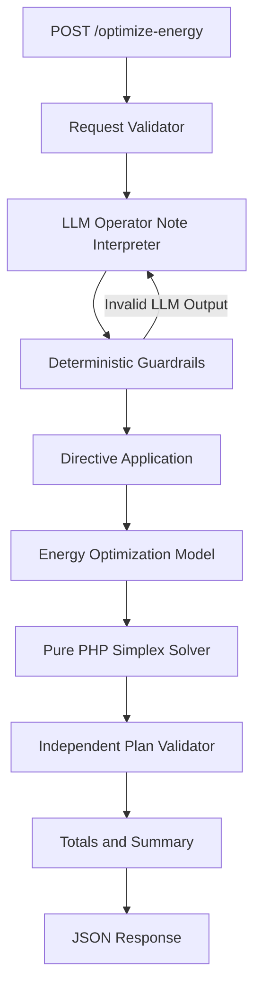

# GridWise — LLM-Assisted Smart Campus Energy Optimization API

> **BUP CSE Fest 2026 Hackathon — Online Preliminary Round**

GridWise is an LLM-assisted energy scheduling API that interprets natural-language campus operator instructions and produces a valid, low-cost 24-hour energy schedule using grid electricity, rooftop solar generation, and battery energy storage.

The solution follows a strict separation of responsibilities:

**Natural-language operator notes → LLM interpretation → deterministic guardrails → directive application → mathematical optimization → independent schedule validation → JSON response**

The LLM is used only to understand operator instructions. All energy calculations, operational constraints, validation, and cost optimization are performed deterministically in PHP.

---

## Project Information

| Item      | Details                                                     |
| --------- | ----------------------------------------------------------- |
| Project   | GridWise                                                    |
| Event     | BUP CSE Fest 2026 Hackathon                                 |
| Round     | Online Preliminary                                          |
| Language  | PHP 8.0+                                                    |
| API Style | REST / JSON                                                 |
| LLM       | Gemini or another OpenAI-compatible model                   |
| Optimizer | Custom pure-PHP Linear Programming / Simplex implementation |
| Database  | Not required                                                |
| Framework | None                                                        |
| Composer  | Not required                                                |
| Docker    | Not used in this implementation                             |

### Live API

**Live Base URL**

```text
https://YOUR-LIVE-DOMAIN.com
```

Replace the URL above with the deployed public endpoint before submission.

### Repository

```text
https://github.com/YOUR-USERNAME/YOUR-REPOSITORY
```

### Solution / Architecture Video

```text
https://YOUR-VIDEO-LINK
```

---

# Table of Contents

1. [Purpose](#purpose)
2. [Problem Overview](#problem-overview)
3. [Solution Architecture](#solution-architecture)
4. [Processing Pipeline](#processing-pipeline)
5. [Supported Operator Directives](#supported-operator-directives)
6. [Optimization Model](#optimization-model)
7. [Battery and Energy Rules](#battery-and-energy-rules)
8. [API Endpoints](#api-endpoints)
9. [Request Schema](#request-schema)
10. [Response Schema](#response-schema)
11. [HTTP Status Codes](#http-status-codes)
12. [Project Structure](#project-structure)
13. [File Responsibilities](#file-responsibilities)
14. [LLM Integration](#llm-integration)
15. [Deterministic Guardrails](#deterministic-guardrails)
16. [Installation](#installation)
17. [Environment Configuration](#environment-configuration)
18. [Running with XAMPP](#running-with-xampp)
19. [Testing the API](#testing-the-api)
20. [Public Sample Test](#public-sample-test)
21. [Postman](#postman)
22. [Security](#security)
23. [Error Handling](#error-handling)
24. [Performance and Reliability](#performance-and-reliability)
25. [Known Limitations](#known-limitations)
26. [Submission Notes](#submission-notes)

---

# Purpose

The GridWise challenge represents a smart campus that has access to:

- grid electricity;
- rooftop solar generation; and
- a battery energy storage system.

For every hour of the next 24 hours, the system receives:

- campus electricity demand;
- available solar generation;
- grid electricity tariff; and
- battery operating limits.

The system also receives between **1 and 3 natural-language operator notes**.

Examples:

```text
Solar output will drop to about 20% from 1 PM to 3 PM.
```

```text
Do not charge the battery between 2 PM and 4 PM.
```

```text
Keep at least 120 kWh in reserve from 6 PM until 9 PM.
```

```text
The cafeteria menu changes tomorrow.
```

The application must determine whether each note affects the current 24-hour energy schedule and translate applicable instructions into a machine-checkable directive.

It must then calculate a valid 24-hour schedule that satisfies all applicable constraints while minimizing grid electricity cost.

---

# Problem Overview

The application performs two distinct tasks.

## 1. Natural-Language Understanding

An LLM interprets every `operator_notes` entry.

The LLM determines:

- whether the note applies;
- the directive type;
- affected hours;
- relevant numeric values; and
- the required structured adjustment.

The LLM does **not** optimize the electricity schedule.

## 2. Mathematical Scheduling

After the LLM output passes deterministic validation, the application converts the interpreted directives into mathematical constraints.

A custom linear-programming solver then determines the lowest-cost valid operating schedule for all 24 hours.

---

# Solution Architecture



The key design principle is:

> **The LLM interprets language. Deterministic code decides whether that interpretation is valid. The optimizer performs the mathematics.**

Operator text is never used directly as an optimization constraint.

---

# Processing Pipeline

A successful request follows this sequence:

```text
Incoming JSON
    ↓
Request schema validation
    ↓
LLM interprets operator_notes
    ↓
Deterministic guardrail validation
    ↓
Applicable directives converted to constraints
    ↓
24-hour linear optimization problem constructed
    ↓
Pure-PHP Simplex solver
    ↓
Hourly schedule generated
    ↓
Independent schedule replay and validation
    ↓
Totals recalculated
    ↓
JSON response
```

This separation prevents malformed or hallucinated model output from directly affecting the mathematical scheduling layer.

---

# Supported Operator Directives

Exactly six directive types are supported.

## 1. `solar_reduction`

Reduces usable solar generation during specified hours.

Example operator note:

```text
Solar output will drop to about 20% from 1 PM to 3 PM.
```

Interpretation:

```json
{
  "note_index": 0,
  "applies": true,
  "directive_type": "solar_reduction",
  "structured_adjustment": {
    "hours": [13, 14],
    "factor": 0.2
  },
  "explanation": "Solar availability is reduced during the specified period."
}
```

`factor` represents the fraction of solar that remains.

Therefore:

```text
80% reduction → factor = 0.20
25% remaining → factor = 0.25
50% remaining → factor = 0.50
```

The optimizer uses:

```text
effective_solar[h] = original_solar[h] × factor
```

---

## 2. `minimum_battery_reserve`

Requires the battery energy to remain above a specified value during selected hours.

Example:

```text
Keep at least 120 kWh in reserve from 6 PM until 9 PM.
```

Interpretation:

```json
{
  "note_index": 0,
  "applies": true,
  "directive_type": "minimum_battery_reserve",
  "structured_adjustment": {
    "hours": [18, 19, 20],
    "minimum_energy_kwh": 120
  },
  "explanation": "The battery must retain at least 120 kWh during the requested window."
}
```

The effective minimum is:

```text
max(base battery minimum, operator reserve)
```

---

## 3. `no_charge_window`

Battery charging is prohibited during specified hours.

Example:

```text
Do not charge the battery between 2 PM and 4 PM.
```

Interpretation:

```json
{
  "note_index": 0,
  "applies": true,
  "directive_type": "no_charge_window",
  "structured_adjustment": {
    "hours": [14, 15]
  },
  "explanation": "Battery charging is unavailable during this period."
}
```

---

## 4. `no_discharge_window`

Battery discharging is prohibited during specified hours.

Example:

```text
Do not discharge the battery between 7 PM and 9 PM.
```

Interpretation:

```json
{
  "note_index": 0,
  "applies": true,
  "directive_type": "no_discharge_window",
  "structured_adjustment": {
    "hours": [19, 20]
  },
  "explanation": "Battery discharging is unavailable during the specified period."
}
```

---

## 5. `max_grid_window`

Limits grid import during specified hours.

Example:

```text
Keep grid import below 150 kWh from 5 PM until 8 PM.
```

Interpretation:

```json
{
  "note_index": 0,
  "applies": true,
  "directive_type": "max_grid_window",
  "structured_adjustment": {
    "hours": [17, 18, 19],
    "max_grid_kwh": 150
  },
  "explanation": "Grid import is capped at 150 kWh during the requested hours."
}
```

---

## 6. `no_op`

Used when an operator note does not affect the current 24-hour energy schedule.

Example:

```text
The cafeteria menu changes tomorrow.
```

Interpretation:

```json
{
  "note_index": 0,
  "applies": false,
  "directive_type": "no_op",
  "structured_adjustment": null,
  "explanation": "The note does not affect the current energy schedule."
}
```

For `no_op`:

```text
applies = false
structured_adjustment = null
```

For all other directive types:

```text
applies = true
```

---

# Time Window Convention

Time ranges use whole-hour intervals with:

> **start included, end excluded**

Examples:

```text
1 PM to 3 PM
→ [13, 14]
```

```text
2 PM to 4 PM
→ [14, 15]
```

```text
6 PM until 9 PM
→ [18, 19, 20]
```

Directive hours must always be:

- integers;
- between `0` and `23`;
- unique; and
- returned in ascending order.

---

# Optimization Model

The mathematical objective is to minimize the total cost of grid electricity over the 24-hour horizon.

```text
total_cost_bdt =
Σ grid_kwh[h] × tariff_bdt_per_kwh[h]
```

for:

```text
h = 0 ... 23
```

The optimizer is implemented completely in PHP.

No external mathematical solver, Python runtime, database, or optimization service is required.

The optimization variables include, for each hour:

```text
grid import
solar used
battery charge
battery discharge
battery energy after the hour
```

The optimizer builds a Linear Programming problem and solves it using the custom implementation in:

```text
src/Simplex.php
```

---

# Battery and Energy Rules

## Battery State

When charging:

```text
E_after = E_before + battery_kwh
```

When discharging:

```text
E_after = E_before - battery_kwh
```

When idle:

```text
E_after = E_before
battery_kwh = 0
```

---

## Battery Bounds

For every hour:

```text
minimum_energy_kwh
≤ battery_energy_after_kwh
≤ capacity_kwh
```

When a `minimum_battery_reserve` directive is active, the higher reserve requirement is used.

---

## Charge Rate

```text
battery_charge
≤ max_charge_kwh_per_hour
```

---

## Discharge Rate

```text
battery_discharge
≤ max_discharge_kwh_per_hour
```

---

## Solar Usage

```text
0
≤ solar_used_kwh
≤ effective_solar_kwh
```

Unused solar may be curtailed.

Grid export is not part of this implementation.

---

## Hourly Energy Balance

Every hour must satisfy:

```text
grid_kwh
+ solar_used_kwh
+ battery_discharge_kwh
=
demand_kwh
+ battery_charge_kwh
```

---

## End-of-Day Battery Neutrality

The battery must finish the planning horizon at exactly the same energy level at which it started.

```text
battery_energy_after_kwh[23]
=
initial_energy_kwh
```

This prevents the optimizer from treating the initial battery energy as free one-time electricity.

---

# API Endpoints

The service exposes exactly two primary endpoints.

## Health Check

```http
GET /health
```

Successful response:

```json
{
  "status": "ok"
}
```

---

## Energy Optimization

```http
POST /optimize-energy
```

Request header:

```http
Content-Type: application/json
```

The endpoint:

1. validates the request;
2. interprets every operator note using the configured LLM;
3. validates the LLM output;
4. applies valid directives;
5. solves the optimization problem;
6. independently validates the final schedule; and
7. returns the complete result.

---

# Request Schema

A valid request contains exactly four top-level fields:

```json
{
  "scenario_id": "string",
  "operator_notes": [],
  "hours": [],
  "battery": {}
}
```

## `scenario_id`

A synthetic scenario identifier.

Example:

```json
"scenario_id": "SAMPLE-01"
```

---

## `operator_notes`

Must contain between **1 and 3 non-empty strings**.

Example:

```json
"operator_notes": [
  "Solar output will drop to about 20% from 1 PM to 3 PM.",
  "The cafeteria menu changes tomorrow."
]
```

---

## `hours`

Must contain exactly **24 entries**, representing hours `0` through `23`.

Each entry contains:

```json
{
  "hour": 0,
  "demand_kwh": 90,
  "solar_kwh": 0,
  "tariff_bdt_per_kwh": 6
}
```

Required fields:

| Field                | Description               |
| -------------------- | ------------------------- |
| `hour`               | Integer from 0 to 23      |
| `demand_kwh`         | Campus electricity demand |
| `solar_kwh`          | Forecast solar generation |
| `tariff_bdt_per_kwh` | Grid electricity price    |

All numeric energy/tariff values must be finite and non-negative.

---

## `battery`

Example:

```json
{
  "capacity_kwh": 220,
  "initial_energy_kwh": 110,
  "minimum_energy_kwh": 40,
  "max_charge_kwh_per_hour": 50,
  "max_discharge_kwh_per_hour": 50
}
```

Required fields:

| Field                        | Description                      |
| ---------------------------- | -------------------------------- |
| `capacity_kwh`               | Maximum battery storage capacity |
| `initial_energy_kwh`         | Battery energy before hour 0     |
| `minimum_energy_kwh`         | Base minimum battery reserve     |
| `max_charge_kwh_per_hour`    | Maximum hourly charge            |
| `max_discharge_kwh_per_hour` | Maximum hourly discharge         |

---

# Response Schema

A successful response contains:

```json
{
  "scenario_id": "...",
  "directive_interpretation": [],
  "hourly_plan": [],
  "total_grid_kwh": 0,
  "total_cost_bdt": 0,
  "peak_grid_kwh": 0,
  "plan_summary": "..."
}
```

---

## `directive_interpretation`

Contains exactly one entry for every operator note.

Each entry contains:

```json
{
  "note_index": 0,
  "applies": true,
  "directive_type": "solar_reduction",
  "structured_adjustment": {
    "hours": [12, 13],
    "factor": 0.25
  },
  "explanation": "Solar generation is reduced during the panel-cleaning period."
}
```

---

## `hourly_plan`

Contains exactly 24 entries.

Each entry contains:

```json
{
  "hour": 0,
  "grid_kwh": 90,
  "solar_used_kwh": 0,
  "battery_action": "idle",
  "battery_kwh": 0,
  "battery_energy_after_kwh": 110
}
```

`battery_action` is exactly one of:

```text
charge
discharge
idle
```

---

## Aggregate Values

### `total_grid_kwh`

Sum of all hourly grid imports.

### `total_cost_bdt`

Calculated as:

```text
Σ grid_kwh[h] × tariff_bdt_per_kwh[h]
```

### `peak_grid_kwh`

Maximum `grid_kwh` value among all 24 hours.

### `plan_summary`

Short human-readable description of the final scheduling strategy.

---

# HTTP Status Codes

|  Code | Meaning                                          |
| ----: | ------------------------------------------------ |
| `200` | Successful health or optimization response       |
| `400` | Malformed JSON or structurally invalid request   |
| `404` | Unknown endpoint                                 |
| `422` | Scenario cannot be safely optimized or validated |
| `500` | Controlled internal or LLM-provider failure      |

The service is designed to fail safely.

Malformed model output is never silently converted into an unsupported energy constraint.

---

# Project Structure

```text
/
├── index.php
├── .htaccess
│
├── src/
│   ├── App.php
│   ├── autoload.php
│   ├── Compat.php
│   ├── Config.php
│   ├── Directives.php
│   ├── Guardrails.php
│   ├── Optimizer.php
│   ├── PlanValidator.php
│   ├── RequestValidator.php
│   ├── Simplex.php
│   │
│   └── LLM/
│       └── Interpreter.php
│
└── public/
    └── router.php
```

A local `.env` file is also used for configuration but **must not be committed to the public repository**.

---

# File Responsibilities

## `index.php`

Main HTTP entry point.

Responsibilities:

- loads the project autoloader;
- loads environment configuration;
- reads the HTTP method;
- resolves the request path;
- reads the request body;
- passes requests to `GridWise\App`;
- sets the HTTP status code; and
- returns JSON.

---

## `.htaccess`

Apache rewrite configuration.

It routes non-file/non-directory requests to:

```text
index.php
```

This allows clean endpoints such as:

```text
/health
/optimize-energy
```

instead of exposing PHP filenames.

---

## `src/App.php`

Central application coordinator.

Responsibilities:

```text
routing
→ JSON decoding
→ request validation
→ LLM interpretation
→ directive application
→ optimization
→ final validation
→ aggregate calculations
→ response generation
```

It also maps failures to controlled HTTP responses.

---

## `src/autoload.php`

Small PSR-style namespace autoloader for:

```text
GridWise\
```

No Composer dependency is required.

---

## `src/Compat.php`

Compatibility helpers used by the project.

This allows the code to avoid relying on functions that may not be available in some older PHP 8.x installations.

---

## `src/Config.php`

Loads environment variables and validates LLM configuration.

Supported LLM provider modes:

```text
openai_compat
ollama
```

Configuration includes:

```text
LLM_PROVIDER
LLM_BASE_URL
LLM_API_KEY
LLM_MODEL
LLM_TIMEOUT_SECONDS
LLM_REPAIR_ATTEMPTS
LLM_CACHE_SIZE
LLM_CACHE_DIR
```

---

## `src/LLM/Interpreter.php`

Natural-language interpretation layer.

Responsibilities:

- constructs the GridWise system prompt;
- sends operator notes to the configured language model;
- requires JSON output;
- converts percentage/fraction reserve language when required;
- understands start-inclusive/end-exclusive time ranges;
- extracts structured JSON;
- passes model output through deterministic guardrails;
- optionally asks the model to repair invalid structured output;
- supports OpenAI-compatible APIs;
- supports OpenAI Responses API when using `api.openai.com`;
- supports Ollama local models.

The model is intentionally not responsible for optimization.

---

## `src/Guardrails.php`

Deterministic validation for LLM-generated directives.

It validates:

```text
exactly one interpretation per note
note_index ordering
allowed directive types
applies semantics
structured_adjustment shape
hours 0–23
unique/ascending hours
solar factor range
battery reserve range
grid cap range
no_op semantics
required explanations
missing/extra fields
```

Only validated directives reach the optimizer.

---

## `src/Directives.php`

Converts validated directives into mathematical scheduling constraints.

It builds:

```text
effective solar by hour
battery reserve floor by hour
grid import cap by hour
no-charge flags
no-discharge flags
```

It also detects incompatible overlapping solar-reduction factors.

---

## `src/RequestValidator.php`

Validates the incoming API request before any LLM call is performed.

It checks:

- exact top-level structure;
- valid `scenario_id`;
- 1–3 operator notes;
- exactly 24 hourly entries;
- unique hours 0–23;
- required hourly fields;
- finite/non-negative numbers;
- battery capacity;
- initial battery state;
- minimum reserve;
- charging rate; and
- discharging rate.

Invalid structural input returns HTTP `400`.

---

## `src/Optimizer.php`

Builds the 24-hour Linear Programming model.

Optimization variables include:

```text
24 grid variables
24 solar variables
24 charge variables
24 discharge variables
24 battery-energy variables
```

Total:

```text
120 optimization variables
```

The model includes:

- hourly energy balance;
- battery state transitions;
- final battery neutrality;
- effective-solar upper limits;
- charge limits;
- discharge limits;
- reserve constraints;
- battery capacity constraints;
- grid-cap constraints; and
- non-negative variables.

The objective minimizes electricity purchase cost.

---

## `src/Simplex.php`

Pure-PHP Linear Programming solver.

The project does not require:

- Python;
- SciPy;
- MATLAB;
- an external optimization API; or
- a commercial solver.

This makes the mathematical layer self-contained and reproducible.

---

## `src/PlanValidator.php`

Independently replays the final schedule after optimization.

It verifies every hour for:

```text
valid hour order
non-negative values
solar availability
grid caps
battery reserve
battery capacity
battery action
charge limits
discharge limits
no-charge directives
no-discharge directives
battery state transition
hourly energy balance
end-of-day neutrality
```

The optimizer result is not trusted until this replay passes.

---

## `public/router.php`

Legacy helper intended for PHP's built-in development-server routing.

It is **not required for the Apache/XAMPP deployment described in this README**.

The primary supported runtime entry point for the current repository is:

```text
/index.php
```

This file may be removed if the project is deployed exclusively through Apache.

---

# LLM Integration

The application supports language models through the configured provider.

For the current Gemini setup, Google's OpenAI-compatible API can be used.

Example configuration:

```dotenv
LLM_PROVIDER=openai_compat
LLM_BASE_URL=https://generativelanguage.googleapis.com/v1beta/openai
LLM_API_KEY=YOUR_GEMINI_API_KEY
LLM_MODEL=YOUR_GEMINI_MODEL
```

The interpreter calls:

```text
/chat/completions
```

for third-party OpenAI-compatible APIs.

The LLM receives:

1. a strict system prompt defining the six supported directives;
2. battery capacity/context; and
3. the operator notes.

Example:

```text
Battery context:
- capacity_kwh: 220
- initial_energy_kwh: 110
- base minimum_energy_kwh: 40

Operator notes:
[0] Facilities will wash the rooftop solar panels from noon until 2 PM.
[1] The sports office moved next month's registration deadline.
```

The model is instructed to return only structured JSON.

Example:

```json
{
  "directive_interpretation": [
    {
      "note_index": 0,
      "applies": true,
      "directive_type": "solar_reduction",
      "structured_adjustment": {
        "hours": [12, 13],
        "factor": 0.25
      },
      "explanation": "Solar availability is reduced during panel cleaning."
    },
    {
      "note_index": 1,
      "applies": false,
      "directive_type": "no_op",
      "structured_adjustment": null,
      "explanation": "The note does not affect the current energy schedule."
    }
  ]
}
```

This JSON is still considered untrusted until `Guardrails.php` validates it.

---

# LLM Repair Mechanism

The model can occasionally return syntactically valid JSON that does not satisfy the exact GridWise schema.

For example:

```json
{
  "hours": [15, 14]
}
```

This fails because hours must be ascending.

When configured with:

```dotenv
LLM_REPAIR_ATTEMPTS=1
```

the application can send the deterministic validation reason back to the LLM and request a corrected JSON response.

If the repaired response also fails validation, the application stops safely rather than inventing a directive.

---

# Deterministic Guardrails

LLM output is never trusted directly.

The guardrail layer verifies the exact GridWise contract before any directive reaches the mathematical optimizer.

Examples of rejected model output include:

```text
unsupported directive type
missing operator-note interpretation
duplicate note index
incorrect note order
hours outside 0–23
duplicate hours
unsorted hours
solar factor greater than 1
negative grid cap
battery reserve above capacity
no_op with applies=true
extra JSON fields
missing required fields
```

This architecture ensures that language-model errors cannot silently modify the energy model.

---

# Installation

## Requirements

Minimum recommended environment:

```text
PHP 8.0+
Apache 2.x
mod_rewrite enabled
allow_url_fopen enabled
OpenSSL enabled
Internet access to the configured LLM provider
```

No database is required.

No Composer installation is required.

No Node.js installation is required.

No Python installation is required.

---

# Environment Configuration

Create a file named:

```text
.env
```

in the project root.

Example Gemini configuration:

```dotenv
LLM_PROVIDER=openai_compat
LLM_BASE_URL=https://generativelanguage.googleapis.com/v1beta/openai
LLM_API_KEY=YOUR_GEMINI_API_KEY
LLM_MODEL=YOUR_GEMINI_MODEL

LLM_TIMEOUT_SECONDS=8
LLM_REPAIR_ATTEMPTS=1

LLM_CACHE_SIZE=0

APP_DEBUG=false
```

## Environment Variables

| Variable              | Description                                                          |
| --------------------- | -------------------------------------------------------------------- |
| `LLM_PROVIDER`        | `openai_compat` or `ollama`                                          |
| `LLM_BASE_URL`        | LLM provider base URL                                                |
| `LLM_API_KEY`         | Hosted-model API key                                                 |
| `LLM_MODEL`           | Model identifier                                                     |
| `LLM_TIMEOUT_SECONDS` | Maximum provider request timeout                                     |
| `LLM_REPAIR_ATTEMPTS` | Number of model-output repair attempts, `0–2`                        |
| `LLM_CACHE_SIZE`      | Cache-related configuration; set to `0` when caching is not required |
| `LLM_CACHE_DIR`       | Optional cache directory configuration                               |
| `APP_DEBUG`           | Enables internal provider error reason in API responses when true    |

For production:

```dotenv
APP_DEBUG=false
```

Never expose detailed provider errors publicly.

---

# Running with XAMPP

This repository can be placed directly in:

```text
C:\xampp\htdocs\
```

Recommended structure:

```text
C:\xampp\htdocs\
├── index.php
├── .htaccess
├── .env
└── src\
```

Start:

```text
Apache
```

from the XAMPP Control Panel.

The API then becomes available at:

```text
http://localhost/
```

Health endpoint:

```text
http://localhost/health
```

Optimization endpoint:

```text
http://localhost/optimize-energy
```

---

# Apache Rewrite Configuration

`mod_rewrite` must be enabled.

The project uses `.htaccess` to route API requests to `index.php`.

For a public deployment, the recommended `.htaccess` is:

```apache
Options -Indexes

RewriteEngine On

<FilesMatch "^\.">
    Require all denied
</FilesMatch>

RewriteRule ^src/ - [F,L]

RewriteCond %{REQUEST_FILENAME} !-f
RewriteCond %{REQUEST_FILENAME} !-d
RewriteRule ^ index.php [QSA,L]
```

This additionally prevents direct access to hidden configuration files such as:

```text
.env
```

and to application source code under:

```text
/src/
```

---

# Testing the API

## Health Check

Using a browser:

```text
http://localhost/health
```

Using curl:

```bash
curl http://localhost/health
```

Expected response:

```json
{
  "status": "ok"
}
```

For the deployed server:

```bash
curl https://YOUR-LIVE-DOMAIN.com/health
```

---

# Public Sample Test

The following request corresponds to the public solar-cleaning example.

Create a temporary file named:

```text
sample-request.json
```

with:

```json
{
  "scenario_id": "SAMPLE-01",
  "operator_notes": [
    "Facilities will wash the rooftop solar panels from noon until 2 PM. During cleaning, usable solar should be treated as roughly 25% of the forecast.",
    "The sports office moved next month's registration deadline."
  ],
  "hours": [
    { "hour": 0, "demand_kwh": 90, "solar_kwh": 0, "tariff_bdt_per_kwh": 6 },
    { "hour": 1, "demand_kwh": 85, "solar_kwh": 0, "tariff_bdt_per_kwh": 6 },
    { "hour": 2, "demand_kwh": 80, "solar_kwh": 0, "tariff_bdt_per_kwh": 5 },
    { "hour": 3, "demand_kwh": 80, "solar_kwh": 0, "tariff_bdt_per_kwh": 5 },
    { "hour": 4, "demand_kwh": 85, "solar_kwh": 0, "tariff_bdt_per_kwh": 5 },
    { "hour": 5, "demand_kwh": 95, "solar_kwh": 0, "tariff_bdt_per_kwh": 6 },
    { "hour": 6, "demand_kwh": 110, "solar_kwh": 5, "tariff_bdt_per_kwh": 8 },
    { "hour": 7, "demand_kwh": 130, "solar_kwh": 20, "tariff_bdt_per_kwh": 10 },
    { "hour": 8, "demand_kwh": 150, "solar_kwh": 50, "tariff_bdt_per_kwh": 12 },
    { "hour": 9, "demand_kwh": 165, "solar_kwh": 90, "tariff_bdt_per_kwh": 14 },
    {
      "hour": 10,
      "demand_kwh": 175,
      "solar_kwh": 130,
      "tariff_bdt_per_kwh": 16
    },
    {
      "hour": 11,
      "demand_kwh": 180,
      "solar_kwh": 160,
      "tariff_bdt_per_kwh": 16
    },
    {
      "hour": 12,
      "demand_kwh": 185,
      "solar_kwh": 180,
      "tariff_bdt_per_kwh": 15
    },
    {
      "hour": 13,
      "demand_kwh": 180,
      "solar_kwh": 170,
      "tariff_bdt_per_kwh": 14
    },
    {
      "hour": 14,
      "demand_kwh": 170,
      "solar_kwh": 140,
      "tariff_bdt_per_kwh": 13
    },
    {
      "hour": 15,
      "demand_kwh": 165,
      "solar_kwh": 90,
      "tariff_bdt_per_kwh": 14
    },
    {
      "hour": 16,
      "demand_kwh": 170,
      "solar_kwh": 45,
      "tariff_bdt_per_kwh": 18
    },
    {
      "hour": 17,
      "demand_kwh": 185,
      "solar_kwh": 10,
      "tariff_bdt_per_kwh": 22
    },
    { "hour": 18, "demand_kwh": 205, "solar_kwh": 0, "tariff_bdt_per_kwh": 28 },
    { "hour": 19, "demand_kwh": 215, "solar_kwh": 0, "tariff_bdt_per_kwh": 30 },
    { "hour": 20, "demand_kwh": 205, "solar_kwh": 0, "tariff_bdt_per_kwh": 26 },
    { "hour": 21, "demand_kwh": 175, "solar_kwh": 0, "tariff_bdt_per_kwh": 18 },
    { "hour": 22, "demand_kwh": 135, "solar_kwh": 0, "tariff_bdt_per_kwh": 10 },
    { "hour": 23, "demand_kwh": 105, "solar_kwh": 0, "tariff_bdt_per_kwh": 7 }
  ],
  "battery": {
    "capacity_kwh": 220,
    "initial_energy_kwh": 110,
    "minimum_energy_kwh": 40,
    "max_charge_kwh_per_hour": 50,
    "max_discharge_kwh_per_hour": 50
  }
}
```

Run:

```bash
curl -X POST http://localhost/optimize-energy \
  -H "Content-Type: application/json" \
  --data-binary "@sample-request.json"
```

Windows:

```bat
curl.exe -X POST "http://localhost/optimize-energy" ^
  -H "Content-Type: application/json" ^
  --data-binary "@sample-request.json"
```

The interpretation should identify:

```text
note 0:
solar_reduction
hours = [12,13]
factor = 0.25
```

and:

```text
note 1:
no_op
applies = false
structured_adjustment = null
```

A valid optimal result should have an equivalent minimum grid-electricity cost to the official public reference.

Equivalent optimal hourly schedules may differ while remaining mathematically valid.

---

# Postman

Create a new request.

Method:

```text
POST
```

URL:

```text
http://localhost/optimize-energy
```

For production:

```text
https://YOUR-LIVE-DOMAIN.com/optimize-energy
```

Select:

```text
Body
→ raw
→ JSON
```

Add:

```http
Content-Type: application/json
```

Paste a valid GridWise scenario and click **Send**.

---

# Example Successful Response

A response has the following structure:

```json
{
  "scenario_id": "SAMPLE-01",
  "directive_interpretation": [
    {
      "note_index": 0,
      "applies": true,
      "directive_type": "solar_reduction",
      "structured_adjustment": {
        "hours": [12, 13],
        "factor": 0.25
      },
      "explanation": "Solar availability is reduced during the panel-cleaning window."
    },
    {
      "note_index": 1,
      "applies": false,
      "directive_type": "no_op",
      "structured_adjustment": null,
      "explanation": "The note does not affect the current energy schedule."
    }
  ],
  "hourly_plan": [
    {
      "hour": 0,
      "grid_kwh": 90,
      "solar_used_kwh": 0,
      "battery_action": "idle",
      "battery_kwh": 0,
      "battery_energy_after_kwh": 110
    }
  ],
  "total_grid_kwh": 2692.5,
  "total_cost_bdt": 38365,
  "peak_grid_kwh": 175,
  "plan_summary": "Applied operator directives and produced a valid 24-hour minimum-grid-cost schedule while restoring the battery to its initial energy."
}
```

The real response contains all 24 hourly entries.

---

# Security

## API Keys

API keys must never be committed to Git.

Do not commit:

```text
.env
API keys
access tokens
passwords
provider credentials
```

Recommended `.gitignore` entry:

```gitignore
.env
.env.*
!.env.example
```

---

## Production Debugging

Always use:

```dotenv
APP_DEBUG=false
```

in production.

When debugging locally:

```dotenv
APP_DEBUG=true
```

may return the internal model-provider error reason.

Do not enable it on the publicly submitted API.

---

## Protect `.env`

If the project root is also the Apache web root, direct access to hidden files must be blocked.

The public server must never allow:

```text
https://YOUR-LIVE-DOMAIN.com/.env
```

Use Apache access restrictions as shown earlier in this README.

---

## Prompt Injection Protection

Operator notes are treated only as domain data.

The system prompt explicitly tells the model to ignore attempts inside an operator note to modify the required output instructions.

Even if a model produces unexpected output, deterministic guardrails still control what reaches the optimizer.

---

# Error Handling

## Invalid JSON / Request

Response:

```http
400 Bad Request
```

Example:

```json
{
  "detail": "invalid request"
}
```

---

## LLM Interpretation Failure

Response:

```http
500 Internal Server Error
```

Production example:

```json
{
  "detail": "operator-note interpretation failed safely"
}
```

With local debugging enabled, an additional `reason` may be returned.

---

## Infeasible / Invalid Optimization Scenario

Response:

```http
422 Unprocessable Entity
```

Example:

```json
{
  "detail": "scenario is not safely optimizable"
}
```

---

## Unknown Endpoint

Response:

```http
404 Not Found
```

Example:

```json
{
  "detail": "not found"
}
```

---

# Performance and Reliability

The mathematical optimizer executes locally in PHP and does not depend on an external optimization service.

The largest variable latency is normally the LLM provider request.

Recommended production configuration:

```dotenv
LLM_TIMEOUT_SECONDS=5
LLM_REPAIR_ATTEMPTS=1
APP_DEBUG=false
```

Before submission, benchmark:

```text
GET /health
POST /optimize-energy
```

under repeated requests.

The final public deployment should remain available for repeated judge calls.

The team is responsible for:

```text
LLM API availability
API quota
provider rate limits
API credentials
network connectivity
deployment availability
```

---

# Validation Philosophy

The application intentionally performs validation at multiple layers.

```text
Request
  ↓
RequestValidator
  ↓
LLM
  ↓
Guardrails
  ↓
Directives
  ↓
Optimizer
  ↓
PlanValidator
  ↓
Response
```

This prevents a single component from becoming the sole source of truth.

For example:

- the LLM cannot directly schedule the battery;
- the optimizer cannot silently violate a directive;
- returned totals are recalculated from the generated plan; and
- the final battery state is independently checked.

---

# Numerical Precision

Optimization results are normalized and rounded to avoid insignificant floating-point noise.

The final validator uses a small numerical tolerance when replaying the schedule.

Returned aggregate values are calculated directly from the final hourly plan.

---

# Supported Deployment Options

The application can run on any environment capable of serving PHP.

Examples include:

```text
Apache + PHP
XAMPP
cPanel hosting
Linux VPS
Nginx + PHP-FPM
Windows Server + Apache/PHP
```

The judging endpoint must be publicly reachable.

`localhost` is suitable only for development.

---

# Production Deployment Checklist

Before submitting:

- replace the live URL placeholder in this README;
- configure a working LLM provider and model;
- keep the API key outside Git;
- set `APP_DEBUG=false`;
- block public access to `.env`;
- block direct public access to `/src`;
- verify `GET /health`;
- verify `POST /optimize-energy`;
- verify at least one official public sample;
- test multiple paraphrased operator notes;
- test malformed requests;
- test provider failure handling;
- verify battery neutrality;
- verify calculated totals;
- benchmark API latency;
- test the API from a network outside the development machine;
- keep the public endpoint online throughout evaluation.

---

# Known Limitations

## External LLM Dependency

When a hosted LLM is used, semantic interpretation depends on the external provider.

Possible external failures include:

```text
rate limiting
quota exhaustion
provider outage
network failure
model unavailability
high latency
```

The application converts provider failures into controlled API errors rather than crashing.

---

## LLM Semantic Accuracy

Deterministic guardrails can verify whether model output follows the allowed schema, but they cannot guarantee that a syntactically valid interpretation is semantically correct.

For this reason, a capable language model and a strict interpretation prompt are used.

---

## Whole-Hour Scheduling

The challenge uses 24 whole-hour intervals.

Sub-hour scheduling is not implemented.

---

## No Grid Export

The model supports grid import only.

Surplus solar may be curtailed.

---

## No Battery Efficiency Loss

The challenge battery model uses direct energy-state transitions and does not model charge/discharge efficiency losses unless introduced by the canonical challenge specification.

---

## No Database

The API is stateless and does not require persistent scenario storage.

---

# Technology Summary

```text
Language:
PHP 8+

Web Server:
Apache / XAMPP compatible

API:
REST + JSON

LLM:
Gemini/OpenAI-compatible API or Ollama

Optimization:
Linear Programming

Solver:
Custom pure-PHP Simplex implementation

Database:
None

External PHP Framework:
None

Composer:
Not required
```

---

# Design Advantages

### Clear separation of AI and mathematics

The LLM handles language only.

The mathematical solution remains deterministic.

### Strict guardrails

Model output cannot directly modify the optimization problem without validation.

### Self-contained optimizer

No external solver service is needed.

### Independent schedule verification

Every generated plan is replayed after optimization.

### Lightweight deployment

The service requires only PHP and an LLM connection.

### Exact JSON contract

The API is designed for automated judge interaction.

---

# Repository Policy

The public repository must not contain credentials.

Before publishing, verify:

```bash
git status
git log --all -- .env
```

and ensure no API key has been committed at any point.

If a credential was accidentally committed, revoke it and remove it from repository history before publication.

---

# Development Notes

The primary runtime entry point is:

```text
index.php
```

Core source code lives under:

```text
src/
```

The main processing sequence is implemented in:

```text
src/App.php
```

LLM interpretation:

```text
src/LLM/Interpreter.php
```

Mathematical optimization:

```text
src/Optimizer.php
src/Simplex.php
```

Validation:

```text
src/RequestValidator.php
src/Guardrails.php
src/PlanValidator.php
```

---

# Quick Start

For an already configured XAMPP installation:

```text
1. Place the repository contents in C:\xampp\htdocs\
2. Create .env
3. Configure the LLM provider/key/model
4. Start Apache
5. Open http://localhost/health
6. POST a GridWise scenario to http://localhost/optimize-energy
```

Expected health response:

```json
{
  "status": "ok"
}
```

---

# Live Submission Information

Update this section before final submission.

### Public API Base URL

```text
https://YOUR-LIVE-DOMAIN.com
```

### Health Endpoint

```text
https://YOUR-LIVE-DOMAIN.com/health
```

### Optimization Endpoint

```text
https://YOUR-LIVE-DOMAIN.com/optimize-energy
```

### GitHub Repository

```text
https://github.com/YOUR-USERNAME/YOUR-REPOSITORY
```

### Architecture / Solution Video

```text
https://YOUR-VIDEO-LINK
```

### LLM Provider

```text
Google Gemini
```

### Model

```text
YOUR-GEMINI-MODEL
```

---

# Final Architecture Summary

```text
                    ┌─────────────────────┐
                    │  Operator Notes     │
                    │  Natural Language   │
                    └──────────┬──────────┘
                               │
                               ▼
                    ┌─────────────────────┐
                    │        LLM          │
                    │ Semantic Extraction │
                    └──────────┬──────────┘
                               │
                               ▼
                    ┌─────────────────────┐
                    │ Deterministic       │
                    │ Guardrails          │
                    └──────────┬──────────┘
                               │
                               ▼
                    ┌─────────────────────┐
                    │ Directive           │
                    │ Application         │
                    └──────────┬──────────┘
                               │
         ┌─────────────────────┼─────────────────────┐
         │                     │                     │
         ▼                     ▼                     ▼
      Demand                  Solar                Battery
         │                     │                     │
         └─────────────────────┼─────────────────────┘
                               │
                               ▼
                    ┌─────────────────────┐
                    │ Linear Programming  │
                    │ Optimization Model  │
                    └──────────┬──────────┘
                               │
                               ▼
                    ┌─────────────────────┐
                    │ Pure-PHP Simplex    │
                    │ Solver              │
                    └──────────┬──────────┘
                               │
                               ▼
                    ┌─────────────────────┐
                    │ Independent Final   │
                    │ Plan Validation     │
                    └──────────┬──────────┘
                               │
                               ▼
                    ┌─────────────────────┐
                    │ 24-Hour GridWise    │
                    │ JSON Response       │
                    └─────────────────────┘
```

---

# Authors

**Team:** `YOUR TEAM NAME`

**Members:**

```text
1. YOUR NAME
2. TEAM MEMBER
3. TEAM MEMBER
```

**Institution:**

```text
YOUR UNIVERSITY / INSTITUTION
```

---

# License / Competition Use

This repository was developed for the **BUP CSE Fest 2026 Hackathon — GridWise Online Preliminary Challenge**.

Use and distribution are subject to the competition rules and any license selected by the team.

---

## Final Note

GridWise deliberately avoids using an LLM as a mathematical optimizer.

Instead, it combines:

> **language understanding from an LLM + deterministic validation + mathematical optimization**

to produce a system that can understand real-world operator instructions while preserving predictable, machine-checkable, and mathematically valid energy scheduling behavior.
