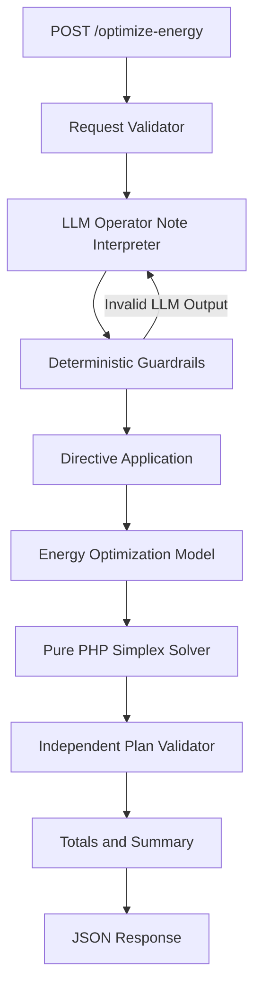

# GridWise — LLM Assisted Smart Energy Optimization API

GridWise is an LLM-assisted energy scheduling API that interprets natural-language campus operator instructions and produces a valid, low-cost 24-hour energy schedule using grid electricity, rooftop solar generation, and battery energy storage.

The solution follows a strict separation of responsibilities:

**Natural-language operator notes → LLM interpretation → deterministic guardrails → directive application → mathematical optimization → independent schedule validation → JSON response**

The LLM is used only to understand operator instructions. All energy calculations, operational constraints, validation, and cost optimization are performed deterministically in PHP.

---

# Problem Overview

The application performs two distinct tasks.

## 1. Natural-Language Understanding

An LLM interprets every `operator_notes` entry.

The LLM determines:

- whether the note applies;
- the directive type;
- affected hours;
- relevant numeric values; and
- the required structured adjustment.

The LLM does **not** optimize the electricity schedule.

## 2. Mathematical Scheduling

After the LLM output passes deterministic validation, the application converts the interpreted directives into mathematical constraints.

A custom linear-programming solver then determines the lowest-cost valid operating schedule for all 24 hours.

---

# Solution Architecture



The key design principle is:

> **The LLM interprets language. Deterministic code decides whether that interpretation is valid. The optimizer performs the mathematics.**

---

# Processing Pipeline

A successful request follows this sequence:

```text
Incoming JSON
    ↓
Request schema validation
    ↓
LLM interprets operator_notes
    ↓
Deterministic guardrail validation
    ↓
Applicable directives converted to constraints
    ↓
24-hour linear optimization problem constructed
    ↓
Pure-PHP Simplex solver
    ↓
Hourly schedule generated
    ↓
Independent schedule replay and validation
    ↓
Totals recalculated
    ↓
JSON response
```

This separation prevents malformed or hallucinated model output from directly affecting the mathematical scheduling layer.

---

# API Endpoints

The service exposes exactly two primary endpoints.

## Health Check

```http
GET /health
```

Successful response:

```json
{
  "status": "ok"
}
```

---

## Energy Optimization

```http
POST /optimize-energy
```

Request header:

```http
Content-Type: application/json
```

The endpoint:

1. validates the request;
2. interprets every operator note using the configured LLM;
3. validates the LLM output;
4. applies valid directives;
5. solves the optimization problem;
6. independently validates the final schedule; and
7. returns the complete result.

---

# Request Schema

A valid request contains exactly four top-level fields:

```json
{
  "scenario_id": "string",
  "operator_notes": [],
  "hours": [],
  "battery": {}
}
```

## `scenario_id`

A synthetic scenario identifier.

Example:

```json
"scenario_id": "SAMPLE-01"
```

---

## `operator_notes`

Must contain between **1 and 3 non-empty strings**.

Example:

```json
"operator_notes": [
  "Solar output will drop to about 20% from 1 PM to 3 PM.",
  "The cafeteria menu changes tomorrow."
]
```

---

## `hours`

Must contain exactly **24 entries**, representing hours `0` through `23`.

Each entry contains:

```json
{
  "hour": 0,
  "demand_kwh": 90,
  "solar_kwh": 0,
  "tariff_bdt_per_kwh": 6
}
```

Required fields:

| Field                | Description               |
| -------------------- | ------------------------- |
| `hour`               | Integer from 0 to 23      |
| `demand_kwh`         | Campus electricity demand |
| `solar_kwh`          | Forecast solar generation |
| `tariff_bdt_per_kwh` | Grid electricity price    |

All numeric energy/tariff values must be finite and non-negative.

---

## `battery`

Example:

```json
{
  "capacity_kwh": 220,
  "initial_energy_kwh": 110,
  "minimum_energy_kwh": 40,
  "max_charge_kwh_per_hour": 50,
  "max_discharge_kwh_per_hour": 50
}
```

Required fields:

| Field                        | Description                      |
| ---------------------------- | -------------------------------- |
| `capacity_kwh`               | Maximum battery storage capacity |
| `initial_energy_kwh`         | Battery energy before hour 0     |
| `minimum_energy_kwh`         | Base minimum battery reserve     |
| `max_charge_kwh_per_hour`    | Maximum hourly charge            |
| `max_discharge_kwh_per_hour` | Maximum hourly discharge         |

---

# Response Schema

A successful response contains:

```json
{
  "scenario_id": "...",
  "directive_interpretation": [],
  "hourly_plan": [],
  "total_grid_kwh": 0,
  "total_cost_bdt": 0,
  "peak_grid_kwh": 0,
  "plan_summary": "..."
}
```

---

## `directive_interpretation`

Contains exactly one entry for every operator note.

Each entry contains:

```json
{
  "note_index": 0,
  "applies": true,
  "directive_type": "solar_reduction",
  "structured_adjustment": {
    "hours": [12, 13],
    "factor": 0.25
  },
  "explanation": "Solar generation is reduced during the panel-cleaning period."
}
```

---

## `hourly_plan`

Contains exactly 24 entries.

Each entry contains:

```json
{
  "hour": 0,
  "grid_kwh": 90,
  "solar_used_kwh": 0,
  "battery_action": "idle",
  "battery_kwh": 0,
  "battery_energy_after_kwh": 110
}
```

`battery_action` is exactly one of:

```text
charge
discharge
idle
```

---

## Aggregate Values

### `total_grid_kwh`

Sum of all hourly grid imports.

### `total_cost_bdt`

Calculated as:

```text
Σ grid_kwh[h] × tariff_bdt_per_kwh[h]
```

### `peak_grid_kwh`

Maximum `grid_kwh` value among all 24 hours.

### `plan_summary`

Short human-readable description of the final scheduling strategy.

---

# HTTP Status Codes

|  Code | Meaning                                          |
| ----: | ------------------------------------------------ |
| `200` | Successful health or optimization response       |
| `400` | Malformed JSON or structurally invalid request   |
| `404` | Unknown endpoint                                 |
| `422` | Scenario cannot be safely optimized or validated |
| `500` | Controlled internal or LLM-provider failure      |

The service is designed to fail safely.

Malformed model output is never silently converted into an unsupported energy constraint.

---

# Project Structure

```text
/
├── index.php
├── .htaccess
│
├── src/
│   ├── App.php
│   ├── autoload.php
│   ├── Compat.php
│   ├── Config.php
│   ├── Directives.php
│   ├── Guardrails.php
│   ├── Optimizer.php
│   ├── PlanValidator.php
│   ├── RequestValidator.php
│   ├── Simplex.php
│   │
│   └── LLM/
│       └── Interpreter.php
│
└── public/
    └── router.php
```

A local `.env` file is also used for configuration but **must not be committed to the public repository**.

---

# LLM Integration

The application supports language models through the configured provider.

For the current Gemini setup, Google's OpenAI-compatible API can be used.

Example configuration:

```dotenv
LLM_PROVIDER=openai_compat
LLM_BASE_URL=https://generativelanguage.googleapis.com/v1beta/openai
LLM_API_KEY=YOUR_GEMINI_API_KEY
LLM_MODEL=YOUR_GEMINI_MODEL
```

The interpreter calls:

```text
/chat/completions
```

for third-party OpenAI-compatible APIs.

The LLM receives:

1. a strict system prompt defining the six supported directives;
2. battery capacity/context; and
3. the operator notes.

Example:

```text
Battery context:
- capacity_kwh: 220
- initial_energy_kwh: 110
- base minimum_energy_kwh: 40

Operator notes:
[0] Facilities will wash the rooftop solar panels from noon until 2 PM.
[1] The sports office moved next month's registration deadline.
```

The model is instructed to return only structured JSON.

Example:

```json
{
  "directive_interpretation": [
    {
      "note_index": 0,
      "applies": true,
      "directive_type": "solar_reduction",
      "structured_adjustment": {
        "hours": [12, 13],
        "factor": 0.25
      },
      "explanation": "Solar availability is reduced during panel cleaning."
    },
    {
      "note_index": 1,
      "applies": false,
      "directive_type": "no_op",
      "structured_adjustment": null,
      "explanation": "The note does not affect the current energy schedule."
    }
  ]
}
```

This JSON is still considered untrusted until `Guardrails.php` validates it.

---

# LLM Repair Mechanism

The model can occasionally return syntactically valid JSON that does not satisfy the exact GridWise schema.

For example:

```json
{
  "hours": [15, 14]
}
```

This fails because hours must be ascending.

When configured with:

```dotenv
LLM_REPAIR_ATTEMPTS=1
```

the application can send the deterministic validation reason back to the LLM and request a corrected JSON response.

If the repaired response also fails validation, the application stops safely rather than inventing a directive.

---

# Deterministic Guardrails

LLM output is never trusted directly.

The guardrail layer verifies the exact GridWise contract before any directive reaches the mathematical optimizer.

Examples of rejected model output include:

```text
unsupported directive type
missing operator-note interpretation
duplicate note index
incorrect note order
hours outside 0–23
duplicate hours
unsorted hours
solar factor greater than 1
negative grid cap
battery reserve above capacity
no_op with applies=true
extra JSON fields
missing required fields
```

This architecture ensures that language-model errors cannot silently modify the energy model.

---

# Installation

## Requirements

Minimum recommended environment:

```text
PHP 8.0+
Apache 2.x
mod_rewrite enabled
allow_url_fopen enabled
OpenSSL enabled
Internet access to the configured LLM provider
```

No database is required.

No Composer installation is required.

No Node.js installation is required.

No Python installation is required.

---

# Environment Configuration

Create a file named:

```text
.env
```

in the project root.

Example Gemini configuration:

```dotenv
LLM_PROVIDER=openai_compat
LLM_BASE_URL=https://generativelanguage.googleapis.com/v1beta/openai
LLM_API_KEY=YOUR_GEMINI_API_KEY
LLM_MODEL=YOUR_GEMINI_MODEL

LLM_TIMEOUT_SECONDS=8
LLM_REPAIR_ATTEMPTS=1

LLM_CACHE_SIZE=0

APP_DEBUG=false
```

## Environment Variables

| Variable              | Description                                                          |
| --------------------- | -------------------------------------------------------------------- |
| `LLM_PROVIDER`        | Your LLM Provider Name                                               |
| `LLM_BASE_URL`        | LLM provider base URL                                                |
| `LLM_API_KEY`         | Hosted-model API key                                                 |
| `LLM_MODEL`           | Model identifier                                                     |
| `LLM_TIMEOUT_SECONDS` | Maximum provider request timeout                                     |
| `LLM_REPAIR_ATTEMPTS` | Number of model-output repair attempts, `0–2`                        |
| `LLM_CACHE_SIZE`      | Cache-related configuration; set to `0` when caching is not required |
| `LLM_CACHE_DIR`       | Optional cache directory configuration                               |
| `APP_DEBUG`           | Enables internal provider error reason in API responses when true    |

For production:

```dotenv
APP_DEBUG=false
```

Never expose detailed provider errors publicly.

---

# Testing the API

## Health Check

Using a browser:

```text
http://localhost/health
```

Using curl:

```bash
curl http://localhost/health
```

Expected response:

```json
{
  "status": "ok"
}
```

For the deployed server:

```bash
curl https://YOUR-LIVE-DOMAIN.com/health
```

---

# Public Sample Test

The following request corresponds to the public solar-cleaning example.

````json
{
  "scenario_id": "SAMPLE-01",
  "operator_notes": [
    "Facilities will wash the rooftop solar panels from noon until 2 PM. During cleaning, usable solar should be treated as roughly 25% of the forecast.",
    "The sports office moved next month's registration deadline."
  ],
  "hours": [
    { "hour": 0, "demand_kwh": 90, "solar_kwh": 0, "tariff_bdt_per_kwh": 6 },
    { "hour": 1, "demand_kwh": 85, "solar_kwh": 0, "tariff_bdt_per_kwh": 6 },
    { "hour": 2, "demand_kwh": 80, "solar_kwh": 0, "tariff_bdt_per_kwh": 5 },
    { "hour": 3, "demand_kwh": 80, "solar_kwh": 0, "tariff_bdt_per_kwh": 5 },
    { "hour": 4, "demand_kwh": 85, "solar_kwh": 0, "tariff_bdt_per_kwh": 5 },
    { "hour": 5, "demand_kwh": 95, "solar_kwh": 0, "tariff_bdt_per_kwh": 6 },
    { "hour": 6, "demand_kwh": 110, "solar_kwh": 5, "tariff_bdt_per_kwh": 8 },
    { "hour": 7, "demand_kwh": 130, "solar_kwh": 20, "tariff_bdt_per_kwh": 10 },
    { "hour": 8, "demand_kwh": 150, "solar_kwh": 50, "tariff_bdt_per_kwh": 12 },
    { "hour": 9, "demand_kwh": 165, "solar_kwh": 90, "tariff_bdt_per_kwh": 14 },
    {
      "hour": 10,
      "demand_kwh": 175,
      "solar_kwh": 130,
      "tariff_bdt_per_kwh": 16
    },
    {
      "hour": 11,
      "demand_kwh": 180,
      "solar_kwh": 160,
      "tariff_bdt_per_kwh": 16
    },
    {
      "hour": 12,
      "demand_kwh": 185,
      "solar_kwh": 180,
      "tariff_bdt_per_kwh": 15
    },
    {
      "hour": 13,
      "demand_kwh": 180,
      "solar_kwh": 170,
      "tariff_bdt_per_kwh": 14
    },
    {
      "hour": 14,
      "demand_kwh": 170,
      "solar_kwh": 140,
      "tariff_bdt_per_kwh": 13
    },
    {
      "hour": 15,
      "demand_kwh": 165,
      "solar_kwh": 90,
      "tariff_bdt_per_kwh": 14
    },
    {
      "hour": 16,
      "demand_kwh": 170,
      "solar_kwh": 45,
      "tariff_bdt_per_kwh": 18
    },
    {
      "hour": 17,
      "demand_kwh": 185,
      "solar_kwh": 10,
      "tariff_bdt_per_kwh": 22
    },
    { "hour": 18, "demand_kwh": 205, "solar_kwh": 0, "tariff_bdt_per_kwh": 28 },
    { "hour": 19, "demand_kwh": 215, "solar_kwh": 0, "tariff_bdt_per_kwh": 30 },
    { "hour": 20, "demand_kwh": 205, "solar_kwh": 0, "tariff_bdt_per_kwh": 26 },
    { "hour": 21, "demand_kwh": 175, "solar_kwh": 0, "tariff_bdt_per_kwh": 18 },
    { "hour": 22, "demand_kwh": 135, "solar_kwh": 0, "tariff_bdt_per_kwh": 10 },
    { "hour": 23, "demand_kwh": 105, "solar_kwh": 0, "tariff_bdt_per_kwh": 7 }
  ],
  "battery": {
    "capacity_kwh": 220,
    "initial_energy_kwh": 110,
    "minimum_energy_kwh": 40,
    "max_charge_kwh_per_hour": 50,
    "max_discharge_kwh_per_hour": 50
  }
}

---

# Example Successful Response

A response has the following structure:

```json
{
  "scenario_id": "SAMPLE-01",
  "directive_interpretation": [
    {
      "note_index": 0,
      "applies": true,
      "directive_type": "solar_reduction",
      "structured_adjustment": {
        "hours": [12, 13],
        "factor": 0.25
      },
      "explanation": "Solar availability is reduced during the panel-cleaning window."
    },
    {
      "note_index": 1,
      "applies": false,
      "directive_type": "no_op",
      "structured_adjustment": null,
      "explanation": "The note does not affect the current energy schedule."
    }
  ],
  "hourly_plan": [
    {
      "hour": 0,
      "grid_kwh": 90,
      "solar_used_kwh": 0,
      "battery_action": "idle",
      "battery_kwh": 0,
      "battery_energy_after_kwh": 110
    }
  ],
  "total_grid_kwh": 2692.5,
  "total_cost_bdt": 38365,
  "peak_grid_kwh": 175,
  "plan_summary": "Applied operator directives and produced a valid 24-hour minimum-grid-cost schedule while restoring the battery to its initial energy."
}
````

The real response contains all 24 hourly entries.

---

# Security

## API Keys

API keys must never be committed to Git.

Do not commit:

```text
.env
API keys
access tokens
passwords
provider credentials
```

Recommended `.gitignore` entry:

```gitignore
.env
.env.*
!.env.example
```

---

# Error Handling

## Invalid JSON / Request

Response:

```http
400 Bad Request
```

Example:

```json
{
  "detail": "invalid request"
}
```

---

## LLM Interpretation Failure

Response:

```http
500 Internal Server Error
```

Production example:

```json
{
  "detail": "operator-note interpretation failed safely"
}
```

With local debugging enabled, an additional `reason` may be returned.

---

## Infeasible / Invalid Optimization Scenario

Response:

```http
422 Unprocessable Entity
```

Example:

```json
{
  "detail": "scenario is not safely optimizable"
}
```

---

## Unknown Endpoint

Response:

```http
404 Not Found
```

Example:

```json
{
  "detail": "not found"
}
```

---

# Performance and Reliability

The mathematical optimizer executes locally in PHP and does not depend on an external optimization service.

The largest variable latency is normally the LLM provider request.

Recommended production configuration:

```dotenv
LLM_TIMEOUT_SECONDS=5
LLM_REPAIR_ATTEMPTS=1
APP_DEBUG=false
```

Before submission, benchmark:

```text
GET /health
POST /optimize-energy
```

under repeated requests.

The final public deployment should remain available for repeated judge calls.

The team is responsible for:

```text
LLM API availability
API quota
provider rate limits
API credentials
network connectivity
deployment availability
```

---

# Validation Philosophy

The application intentionally performs validation at multiple layers.

```text
Request
  ↓
RequestValidator
  ↓
LLM
  ↓
Guardrails
  ↓
Directives
  ↓
Optimizer
  ↓
PlanValidator
  ↓
Response
```

This prevents a single component from becoming the sole source of truth.

For example:

- the LLM cannot directly schedule the battery;
- the optimizer cannot silently violate a directive;
- returned totals are recalculated from the generated plan; and
- the final battery state is independently checked.

---

# Numerical Precision

Optimization results are normalized and rounded to avoid insignificant floating-point noise.

The final validator uses a small numerical tolerance when replaying the schedule.

Returned aggregate values are calculated directly from the final hourly plan.

---

# Final Architecture Summary

```text
                    ┌─────────────────────┐
                    │  Operator Notes     │
                    │  Natural Language   │
                    └──────────┬──────────┘
                               │
                               ▼
                    ┌─────────────────────┐
                    │        LLM          │
                    │ Semantic Extraction │
                    └──────────┬──────────┘
                               │
                               ▼
                    ┌─────────────────────┐
                    │ Deterministic       │
                    │ Guardrails          │
                    └──────────┬──────────┘
                               │
                               ▼
                    ┌─────────────────────┐
                    │ Directive           │
                    │ Application         │
                    └──────────┬──────────┘
                               │
         ┌─────────────────────┼─────────────────────┐
         │                     │                     │
         ▼                     ▼                     ▼
      Demand                  Solar                Battery
         │                     │                     │
         └─────────────────────┼─────────────────────┘
                               │
                               ▼
                    ┌─────────────────────┐
                    │ Linear Programming  │
                    │ Optimization Model  │
                    └──────────┬──────────┘
                               │
                               ▼
                    ┌─────────────────────┐
                    │ Pure-PHP Simplex    │
                    │ Solver              │
                    └──────────┬──────────┘
                               │
                               ▼
                    ┌─────────────────────┐
                    │ Independent Final   │
                    │ Plan Validation     │
                    └──────────┬──────────┘
                               │
                               ▼
                    ┌─────────────────────┐
                    │ 24-Hour GridWise    │
                    │ JSON Response       │
                    └─────────────────────┘
```

---

# Authors

**Team:** `TheNorseVoyage`

**Members:**

```text
1. Tahmidul Haque Tasin
2. Naimul Islam Fabian
3. Irfan Ul Islam
4. Promit Debnath
```
